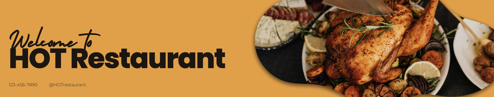

# HOT Restaurant Website

A modern restaurant website built with React and Tailwind CSS showcasing a responsive design, interactive shopping cart functionality, and dynamic content management.

## Features

- **Responsive Design**: Mobile-first approach ensures beautiful display on all devices
- **Interactive Menu**: Browse menu items with descriptions and pricing
- **Shopping Cart**: Add and remove items, view cart totals
- **Location Map**: Google Maps integration on the Contact page
- **Contact Form**: Interactive form for customer inquiries
- **Dynamic Content**: Content management through central data stores

## Tech Stack

- **Frontend**: React.js with Hooks and Context API
- **Styling**: Tailwind CSS for utility-first styling
- **Routing**: Wouter for simple routing
- **State Management**: React Context API for global state
- **Build Tools**: Vite for fast development and bundling
- **Backend**: Express.js server (minimal functionality)

## Setup

1. Clone the repository
2. Install dependencies with `npm install`
3. Follow instructions in [LOCAL_SETUP.md](LOCAL_SETUP.md) for local development
4. Run the development server with `npm run dev:local`

## Project Structure

- `/client`: Frontend React application
  - `/src`: Source code for the React app
    - `/components`: Reusable UI components
    - `/context`: React context providers
    - `/data`: Static data and assets
    - `/pages`: Page components
    - `/lib`: Utility functions
- `/server`: Backend Express server
- `/public/images`: Images used in the application

## Screenshots

## License

MIT

## Created By

[Your Name] - [Your Link/Portfolio]